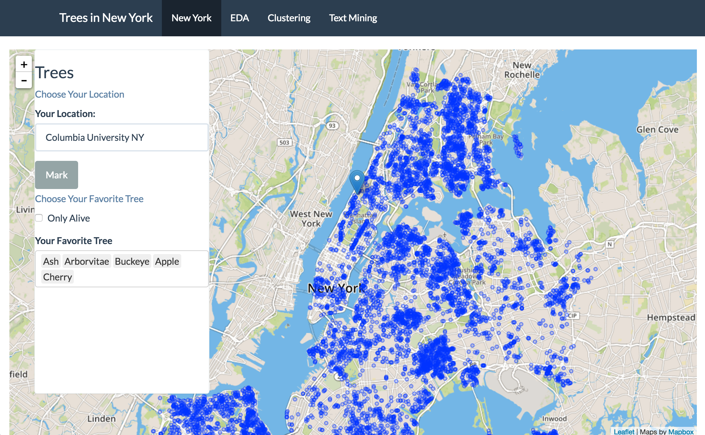

# Project: Open Data NYC - an RShiny app development project
### [Project Description](doc/project2_desc.md)

Term: Fall 2016

+ Team #5
+ Projec title: New York City Trees
+ Team members
	+ Wenhang Bao
	+ Yanxi Chen
	+ Kanghui Jiang
	+ Mengyuan Tao
	+ Jiayu Wang
	
+ Project summary: In this project, we explore the distribution of all categories of trees in New York City. According to their distributions and health conditions, we analyze the problems existing in the protection of trees in different communities. And we also give descrptions of trees for education purpose. In EDA part, we enable users to investigate the relationship between health condition of trees and specific problems met by the trees.

In this second project of Applied Data Science, we will carry out *Exploratory Data Analysis and Visualization* via a shiny app on a topic about open data released from the [New York City open data portal](https://nycopendata.socrata.com/). See [Project 2 Description](doc/project2_desc.md) for more details.  




The **learning goals** for this project is 
- business intelligence for data science
- systems development/design life cycle
- shiny app/shiny server
	
**Contribution statement**: ([default](doc/a_note_on_contributions.md)) All team members contributed equally in all stages of this project. All team members approve our work presented in this GitHub repository including this contributions statement. 

Following [suggestions](http://nicercode.github.io/blog/2013-04-05-projects/) by [RICH FITZJOHN](http://nicercode.github.io/about/#Team) (@richfitz). This folder is orgarnized as follows.

```
proj/
├── lib/
├── data/
├── doc/
├── figs/
└── output/
```

Please see each subfolder for a README file.

